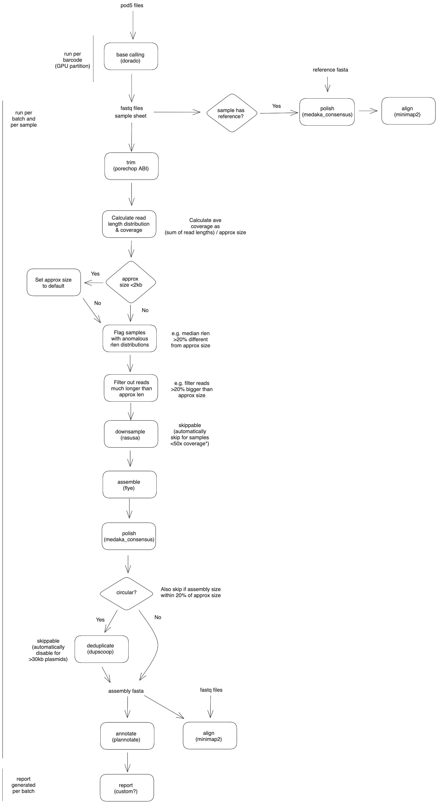

# WEHI plasmid validation pipeline

## What it does

The WEHI plasmid validation pipeline is a workflow for assembling circular and linear plasmid constructs from Nanopore sequencing data. A flowchart is shown below:

The pipeline runs the following software:

- [Dorado](https://github.com/nanoporetech/dorado): base calling.
- [Minimap2](https://github.com/lh3/minimap2): for alignment.
- [Porechop ABI](https://github.com/bonsai-team/Porechop_ABI): adapter trimming.
- [Rasusa](https://github.com/mbhall88/rasusa): down-sampling.
- [Flye](https://github.com/fenderglass/Flye): de-novo assembly.
- [Medaka](https://github.com/nanoporetech/medaka): polishing.
- [Dupscoop](https://github.com/mckennalab/DupScoop): deduplication for circular constructs.
- [Plannotate](https://github.com/mmcguffi/pLannotate): for annotation.

## Installation

## Testing

## Configuration

The pipeline requires pod5/fast5, or already basecalled fastq files, and a sample sheet. The sample sheet requires a tab-separated file with the following fields:

- `researcher_id`: the researcher to whom the plasmid sample belongs. Determines output directory.
- `barcode`: barcode numnber of the plasmid sample.
- `sample_id`: sample identifier.
- `approx_size`: approximate size of plasmid construct.
- `reference`: reference fasta file for the plasmid sample.
- `circular`: true/false value; whether the plasmid is a circular or linear construct.

## Running

## Output

The pipeline outputs a fasta assembly per plasmid sample, alignments to that assembly and a report with annotations. If a reference was provided for the plasmid, the reads will be aligned to the provided reference as well.
